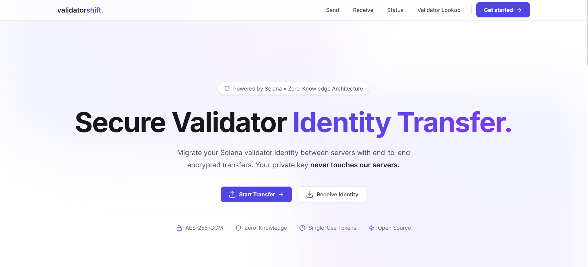

# Solana Validator Identity Transfer

<div align="center">
  
</div>

---

A production-ready, **secure full-stack application** that simplifies the process of transferring a Solana validator's identity between different servers. Built for the Superteam Ukraine community.

Built with **Rust** (Actix-Web, sqlx, clap), **Next.js** (App Router, Tailwind CSS), and the **Web Crypto API** for zero-knowledge client-side encryption. Includes a **Rust CLI** for headless environments.

---

## Table of Contents
1. [Features](#features)
2. [Architecture Overview](#architecture-overview)
3. [Quick Start](#quick-start)
4. [Configuration](#configuration)
5. [Security Model](#security-model)
6. [Key Architectural Decisions](#key-architectural-decisions)
7. [Trade-offs](#trade-offs)
8. [Project Structure](#project-structure)

---

## Features
| Capability | Details |
|---|---|
| **Zero-Knowledge Architecture** | The plaintext validator keypair never leaves the browser. Encryption and decryption happen entirely client-side. |
| **AES-256-GCM Encryption** | Military-grade authenticated encryption ensures the payload is protected in transit and at rest. |
| **PBKDF2 Key Derivation** | Uses PBKDF2-SHA256 with 600,000 iterations (OWASP recommended) to derive the AES key from the user's passphrase. |
| **Single-Use Tokens** | Transfers generate a one-time token. Once the payload is downloaded, the server permanently destroys the record. |
| **Time-based Expiry** | Tokens automatically expire after a configurable duration (default 15 minutes) if not claimed. |
| **Solana RPC Integration** | Built-in validator lookup queries the Solana network to verify stake, commission, and delinquency status. |
| **Comprehensive Audit Trail** | Server logs IP addresses (optional/hashed), timestamps, and status changes for strict accountability. |
| **Concurrent Execution** | `concurrently` is configured to launch both the Rust backend and Next.js frontend with a single command. |

---

## Architecture Overview

```text
┌─────────────────────────────────────────────────────────────────────────────┐
│                             Monorepo Workspace                              │
│                                                                             │
│  ┌─────────────────────────┐               ┌─────────────────────────────┐  │
│  │   Next.js Frontend      │               │   Rust Actix-Web Backend    │  │
│  │  ┌───────────────────┐  │               │  ┌───────────────────────┐  │  │
│  │  │ Web Crypto API    │  │     HTTPS     │  │ REST API (Handlers)   │  │  │
│  │  │ (AES-GCM/PBKDF2)  ├──┼───────┬───────┼─►│ Rate Limiting         │  │  │
│  │  └───────────────────┘  │       │       │  └──────────┬────────────┘  │  │
│  └─────────────────────────┘       │       │             │               │  │
│                                    │       │  ┌──────────▼────────────┐  │  │
│  ┌─────────────────────────┐       │       │  │ SQLite Database       │  │  │
│  │   Rust CLI Tool         │       │       │  │ (Encrypted Blobs,     │  │  │
│  │  ┌───────────────────┐  │       │       │  │  Audit Logs)          │  │  │
│  │  │ rust-crypto       │  │       │       │  └───────────────────────┘  │  │
│  │  │ (AES-GCM/PBKDF2)  ├──┼───────┘       └─────────────┬───────────────┘  │
│  │  └───────────────────┘  │                             │                  │
│  └─────────────────────────┘                             │                  │
└──────────────────────────────────────────────────────────┼──────────────────┘
                                                           │
                                                   Solana Mainnet RPC
```

1. **Upload & Encrypt** — The user drops `validator-keypair.json` into the browser. The frontend derives a key via PBKDF2 and encrypts the JSON array using AES-256-GCM.
2. **Transit & Store** — The encrypted blob, salt, and IV are sent to the Rust backend and stored in SQLite. The backend returns a short-lived, single-use token.
3. **Download & Decrypt** — The destination operator enters the token and the original passphrase. The frontend fetches the encrypted blob and decrypts it locally. The backend deletes the database row immediately after the download request.

---

## Quick Start

### Prerequisites
- Node.js >= 18 & `pnpm`
- Rust & Cargo
- OpenSSL (for Rust dependencies)

### 1. Clone and Configure
```bash
git clone https://github.com/your-org/solana-validator-identity-transfer.git
cd solana-validator-identity-transfer
pnpm install
```

Setup environment variables for the backend:
```bash
cd backend
cp .env.example .env # Ensure HMAC_SECRET is set securely
cd ..
```

### 2. Run Locally
We use `concurrently` to launch the full stack in one terminal:
```bash
pnpm run dev
```
- Frontend runs on `http://localhost:3000`
- Backend API runs on `http://localhost:8080/api/v1`

### 3. Production Build
```bash
# Builds both Next.js and Rust binaries
pnpm run build

# Starts both services concurrently
pnpm run start
```

### 4. CLI Tool (Headless Servers)
For validator operators preferring the terminal:
```bash
cd cli
cargo build --release

# Send identity
./target/release/validator-shift-cli send --file /path/to/validator-keypair.json

# Receive identity
./target/release/validator-shift-cli receive --token <YOUR_TOKEN> --output ./validator-keypair.json
```

---

## Configuration

### Backend (`backend/.env`)
| Variable | Default | Description |
|---|---|---|
| `DATABASE_URL` | `sqlite:./data/transfers.db?mode=rwc` | SQLite connection string |
| `HMAC_SECRET` | **required** | 32+ char secret for hashing tokens/IDs |
| `TRANSFER_EXPIRY_MINUTES`| `15` | How long before a pending transfer is burned |
| `SOLANA_RPC_URL` | `https://api.mainnet-beta.solana.com` | Solana RPC for validator info |
| `RUST_LOG` | `info` | Logging verbosity |

### Frontend (`frontend/.env.local`)
| Variable | Default | Description |
|---|---|---|
| `NEXT_PUBLIC_API_URL` | `http://localhost:8080/api/v1` | URL of the Rust backend |

---

## Security Model

- **Client-Side First**: The backend API endpoints do not accept raw keypairs. The frontend actively blocks submission if encryption fails.
- **Brute-Force Resistance**: PBKDF2 uses 600,000 iterations to make offline dictionary attacks computationally expensive if an attacker gains access to the database.
- **Ephemeral Storage**: Transfers are inherently ephemeral. A background cron job in Rust actively scrubs expired transfers from the database.
- **HMAC Tokens**: Transfer tokens issued to users are never stored in plaintext in the database; they are hashed using `HMAC-SHA256` preventing a database leak from exposing active tokens.

### Cryptography Edge Cases & Supply Chain Security
When selecting the cryptographic stack, we evaluated bleeding-edge memory-hard functions (like Argon2id) and Solana-native encryption (like TweetNaCl `XSalsa20-Poly1305`). However, adopting these would require importing third-party WebAssembly (WASM) or NPM packages into the browser.
* **The Supply Chain Edge Case**: In Web3, a malicious update to a cryptography NPM dependency is a severe vulnerability. By exclusively using the browser's native **Web Crypto API** (`AES-256-GCM` and `PBKDF2`), we achieve zero-dependency encryption. It is impossible for a compromised NPM package to hijack the cryptographic operations.
* **The Offline Brute-Force Edge Case**: While PBKDF2 is theoretically less resistant to offline GPU cracking than Argon2id, we mitigate this edge case entirely at the architectural level. By enforcing strict time-based token expiry (maximum 60 minutes) and single-use burn mechanics, an attacker does not have the timeframe required to execute an offline brute-force attack on a leaked database blob.

---

## Key Architectural Decisions

### 1. Rust vs. Node.js for the Backend
We explicitly chose Rust (`actix-web`) over Node.js to mitigate severe runtime edge cases:
* **Absolute Memory Safety**: Node.js relies on an interpreter and garbage collection, making it susceptible to prototype pollution via malicious NPM packages or runtime memory leaks. Rust guarantees memory safety at compile-time, effectively eliminating the edge case of a buffer overflow exposing decrypted or encrypted validator blobs in server memory.
* **Compile-Time SQL Verification**: In Node.js, ORM edge cases or malformed queries often panic at runtime. We use the Rust `sqlx` library, which connects to the SQLite database *during compilation*. A bad SQL query will fail the build, ensuring zero SQL-related runtime panics in production.
* **Solana Ecosystem Alignment**: Since the Solana client and smart contracts are written in Rust, using Rust on the backend ensures seamless integration with native Solana cryptographic primitives if future expansion is required.

### 2. SQLite for Storage
Given that transfers are ephemeral and immediately deleted upon download, a heavy persistent database like PostgreSQL was unnecessary. SQLite provides atomic transactions and zero-configuration deployment, perfect for this isolated use-case.

### 3. Next.js App Router
Provides a secure environment with standard React patterns. We strictly enforce `"use client"` on cryptography pages to guarantee no server-side rendering accidentally leaks passphrase inputs to backend server logs.

---

## Trade-offs

| Area | Choice | What we give up |
|---|---|---|
| **Key Recovery** | Strict Zero-Knowledge | If the user loses their passphrase before the destination downloads the key, the keypair is unrecoverable. They must create a new transfer. |
| **Database** | SQLite | Horizontal scaling of the backend requires mounting a shared volume or migrating to Postgres. |
| **Token Delivery** | Manual | The app does not email or SMS the token; the user is responsible for transmitting the token via a secure side-channel (e.g., Signal). |

---

## Project Structure

```text
solana-validator-identity-transfer/
├── package.json               # Workspace root (concurrently scripts)
├── cli/                       # Rust CLI Tool
│   ├── Cargo.toml
│   └── src/
│       ├── main.rs            # clap arg parser
│       ├── api.rs             # reqwest client
│       ├── crypto.rs          # AES-256-GCM / PBKDF2 logic
│       └── commands/          # send & receive subcommands
├── frontend/                  # Next.js Web App
│   ├── next.config.ts
│   ├── src/
│   │   ├── app/               # Next.js App Router (Send, Receive, Status)
│   │   ├── components/        # React UI components
│   │   └── lib/
│   │       ├── api.ts         # Strictly typed API client
│   │       └── crypto.ts      # Web Crypto API wrappers
│   └── package.json
└── backend/                   # Rust Actix-Web API
    ├── Cargo.toml
    ├── migrations/            # sqlx SQLite migrations
    ├── src/
    │   ├── main.rs            # Actix-Web server initialization
    │   ├── handlers.rs        # REST API endpoints
    │   ├── crypto.rs          # Server-side hashing & HMAC logic
    │   ├── db.rs              # Database CRUD & background cleanup
    │   └── solana_rpc.rs      # Solana validator lookups
    └── package.json
```
